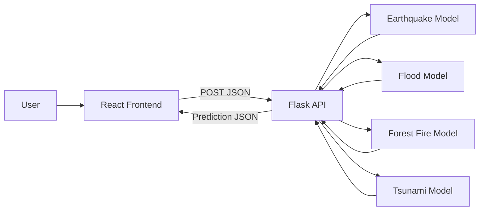

<div align="center">

# 🌍 Disaster Predictor
### *A Multi-Hazard Intelligence Interface for Early Risk Awareness*

<p>
  
  
  
  
</p>

<p>
  A disaster forecasting dashboard prototype that brings together <b>earthquake</b>, <b>flood</b>, <b>forest fire</b>, and <b>tsunami</b> risk prediction workflows in one experience.
</p>

</div>

---

## ✨ Why this project exists
Natural hazard risk decisions often happen under pressure. This project explores a single interface where different disaster-type inputs can be captured quickly and sent to ML models for a prediction response.

### 🎯 Current experience
- **Landing page** with disaster-type navigation cards.
- Dedicated screens for:
  - Earthquake prediction
  - Forest Fire prediction
  - Tsunami prediction
  - Flood prediction (component exists, route wiring is incomplete in app routing)
- Flask API endpoints for all four prediction services.

---

## 🧠 System Architecture



---

## 🧩 Tech Stack

| Layer | Technology | Role |
|---|---|---|
| Frontend | React + React Router | Multi-page UI and interaction flows |
| Frontend Maps | react-leaflet (imported in earthquake page) | Geospatial UI foundation |
| Backend | Flask | Lightweight prediction API server |
| ML Runtime | joblib + pandas | Model loading and request data shaping |
| Models | `.joblib` / `.pkl` assets | Hazard-specific prediction inference |

---

## 📁 Project Structure

```text
Disaster-Prediction/
├── public/
├── src/
│   ├── api/
│   │   ├── main.py
│   │   └── models/
│   ├── App.js
│   ├── Front.js
│   ├── Features.js
│   ├── EarthquakePrediction.js
│   ├── ForestFirePrediction.js
│   ├── TsunamiPrediction.js
│   └── FloodPrediction.js
├── main005.py
├── requirements.txt
└── README.md
```

---

## 🚀 Quick Start

## 1) Clone & install frontend dependencies
```bash
git clone <your-repo-url>
cd Disaster-Prediction
npm install
```

## 2) Run the React frontend
```bash
npm start
```
Frontend runs at: **http://localhost:3000**

## 3) Set up Python backend
```bash
python -m venv .venv
source .venv/bin/activate        # Windows: .venv\Scripts\activate
pip install -r requirements.txt
python src/api/main.py
```
Backend runs at: **http://127.0.0.1:5000**

---

## 🔌 API Endpoints

Base URL: `http://127.0.0.1:5000`

| Endpoint | Method | Purpose |
|---|---|---|
| `/earthquake` | POST | Earthquake risk prediction |
| `/flood` | POST | Flood risk prediction |
| `/forestfire` | POST | Forest fire risk prediction |
| `/tsunami` | POST | Tsunami risk prediction |

### Example request
```bash
curl -X POST http://127.0.0.1:5000/earthquake \
  -H "Content-Type: application/json" \
  -d '[{"latitude": 12.1, "longitude": 77.5, "depth": 8.3, "date": "2026-04-11"}]'
```

---

## 🛠️ Improvement Roadmap

- [ ] Connect frontend form submit actions to Flask endpoints.
- [ ] Add client-side + server-side validation.
- [ ] Wire flood route in `App.js`.
- [ ] Add unified prediction result cards with confidence details.
- [ ] Add model metadata/version display.
- [ ] Add test coverage for API routes and form workflows.

---

## ⚠️ Important Notes

- This project is currently a **prototype** and should not be used as a real emergency warning system.
- Prediction quality depends entirely on model quality, features used, and proper validation.
- Some frontend flows are scaffolds and need API integration.

---

## 🤝 Contributing

1. Fork the repository
2. Create a feature branch
3. Commit your changes
4. Open a pull request

---

## 📜 License

i have nothing.

---

<div align="center">
Built with curiosity, code, and climate resilience in mind. 🌊🔥🌲🌍
</div>
